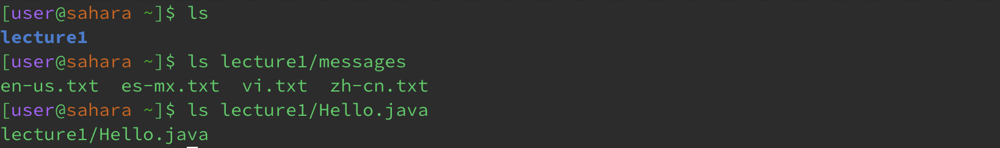
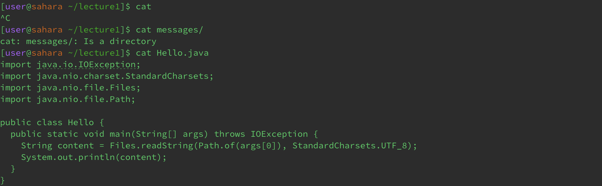

# Lab Report 1
**cd examples**\

1. In the first example when running `cd` without an argument in the working directory `/home`, the working directory changed to the home directory which is the intended function of the command.
2. When running the second example, the working directory changed from `/home` to `/home/lecture1` where the directory `/lecture1` is in `/home`. This is not an error because the working directory changed as intended to the directory provided.
3. In the third example, the terminal returned an error message because when given an argument, the cd command expects a directory/path to a directory, not a file. You can not change directories into a file, which in this case is `Hello.java`. This command was run in the directory `/home/lecture1`\
**ls examples**

1. In the first example, running `ls` with no argument returned a list of files and directories located in the working directory `/home` as intended. When provided no argument, the ls command returns the contents of the current directory.
2. In the second example, running `ls` in the directory `/home` while providing a path to a folder returns the contents of said folder as intended.
3. In the third example, running `ls` in the directory `/home` while providing a path to a file returns the name/path of the file if it exists as intended. \
**cat examples**

1. In the first example, running the `cat` command in the directory `/home/lecture1` with no argument returned no output while the terminal waited for inputs. Anything entered in the terminal would be echoed back until receiving an end-of-file signal, and this behavior is not an error as it is the intended behavior of the command.
2. In the second example, running the `cat` command in the directory `/home/lecture1` while providing a directory as an argument returned an error because `cat` expects a file as an argument.
3. In the third example, running the `cat` command in the directory `/home/lecture1` while providing a file as an argument returned the text contents of said file as intended by the function of the command.

